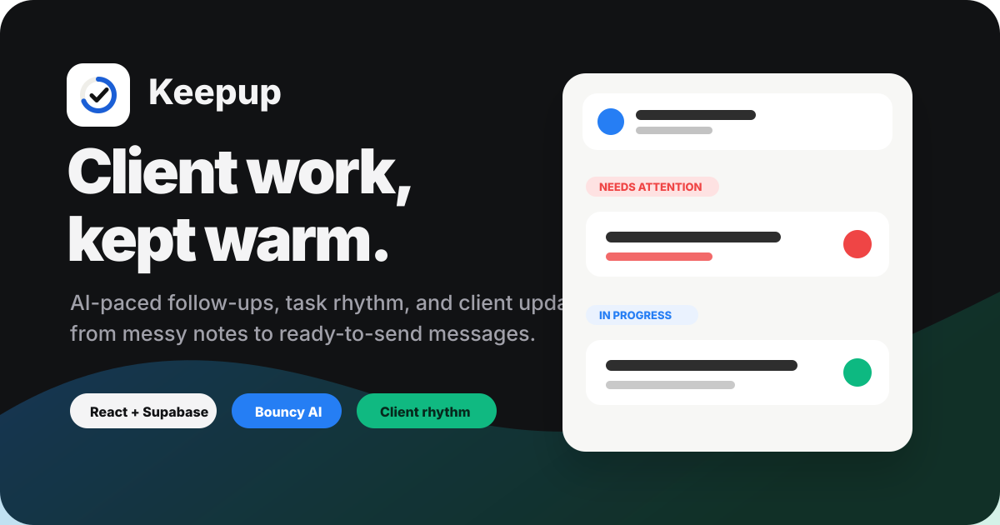
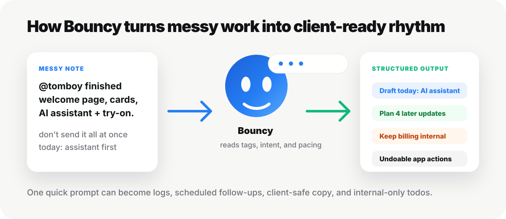

# Keepup



**Keepup** is an AI-powered client-work tracker for people who do ongoing work, send progress updates, wait on approvals, and need to keep clients warm without letting anything quietly go stale.

It is not just a todo list. Keepup tracks the rhythm of work: what moved, who needs an update, who is waiting on whom, and what should be said to the client next.

[](https://react.dev/)
[](https://www.typescriptlang.org/)
[](https://supabase.com/)
[](https://vite.dev/)

## The Idea

Client work has a weird hidden layer:

- You finish three things, but should not dump all of them on the client at once.
- You need to nudge someone, but politely, because they owe you content or approval.
- You sent an update last Tuesday, but now the task has gone quiet.
- You remember the work, but not the exact wording you should send today.

Keepup turns that into a workflow.

Tasks have due dates, check-in cadence, client grouping, update logs, waiting states, planned updates, and urgency. The app keeps the work honest by showing what needs attention instead of only showing what exists.

## Bouncy, The Assistant



Keepup has an in-app assistant called **Bouncy**. It lives in the bottom panel and behaves like a small command bar for messy work notes.

You can type something rough like:

```text
@tomboy finished the welcome page, fixed product cards, added AI shopping assistant and try-on.
don't send it all at once. today tell them about the assistant and ask them to try it.
waiting on me: enable billing
```

Bouncy can split that into:

- a planned client update for today
- later updates scheduled across future check-in days
- internal todos that should not be shown to the client
- a ready-to-copy client message
- undoable actions in the app

If you say **send everything at once**, Bouncy writes one combined update. If you say **do not tell them all at once**, Bouncy breaks the progress into smaller client-facing messages so the work stays visible over time.

## `@` Mentions For Work

Every task gets a small handle, so you can talk to Bouncy naturally:

```text
@tomboy sent the homepage preview
@sonajhuri waiting on product photos
@sonajhuri/website what should I send today?
```

Keepup supports:

- task handles like `@tomboy`
- client handles like `@sonajhuri`
- nested handles like `@sonajhuri/website` when a client has multiple tasks
- inline mention suggestions while typing
- highlighted mention pills in the input

A tag is treated as definitive context, so Bouncy does not have to guess which task you mean.

## Paced Client Updates

One of Keepup's main workflow features is **planned client updates**.

When a lot of work gets done at once, Bouncy can break it into a sequence like:

| Order | Update | Why it matters |
| --- | --- | --- |
| 1 | AI shopping assistant | A strong feature to show today |
| 2 | Product card improvements | Visible storefront polish |
| 3 | Homepage headline animation | Motion and first impression |
| 4 | Welcome page | Larger content milestone |
| 5 | AI try-on | Save the most impressive reveal for later |

The messages are written for clients, not developers. Bouncy avoids internal jargon, code details, vendor names, and implementation noise. It focuses on what the client and their customers get.

When you send a draft outside the app, you can click **Mark as sent**. Keepup logs it as a real check-in, marks the planned update as sent, and resets the task's follow-up timer.

## Waiting States

Keepup understands the difference between being blocked by a client and being blocked internally.

```text
waiting on client for homepage content
```

That keeps the task active but changes the check-in rhythm into polite nudges.

```text
waiting on office for final designs
```

That removes the client nudge rhythm, because it is internal and not something the client should be chased for.

This matters because a fake progress log can hide a task that actually needs attention. Keepup separates real updates from status fields.

## Bouncy Feels Alive

Bouncy is not just a plain chat box.

- Its orb has eyes that follow the pointer.
- It blinks and glances around when idle.
- While you type, it looks down and reads along.
- If you pause, it looks up toward its thought bubble.
- While it is thinking, it shifts into a different animated mood.
- On hover or tap, it does a small dance.
- It shows tiny thought-bubble quips while you type.

That little personality makes the assistant feel like part of the workspace instead of a generic chatbot bolted onto the side.

## Core Features

- Email/password authentication
- Supabase Postgres with row-level security
- Realtime sync across tabs and devices
- Optimistic UI updates
- Agency and personal workspaces
- Client/project grouping
- Custom client colors
- Task due dates and completion history
- Check-in cadence per task or client
- Quiet/stale/urgent attention states
- Waiting/on-hold states
- Planned client updates
- Calendar view
- Year and stats insights
- Archive and 30-day trash
- Saved Bouncy chat history
- Undo support for AI-applied changes
- Screenshot/image context for the assistant
- Theme and density preferences
- Collapsible, resizable sidebar
- Keyboard shortcuts like `/` for Bouncy and `N` for new task

## Tech Stack

| Layer | Tech |
| --- | --- |
| Frontend | React, TypeScript, Vite |
| Styling | Tailwind CSS |
| Backend | Supabase Auth, Postgres, Realtime |
| AI | Supabase Edge Function |
| Assistant Models | Gemini by default, Claude fallback support |
| Data Safety | Postgres RLS policies per user |

## Local Setup

1. Create a Supabase project.
2. In Supabase SQL editor, run `supabase/schema.sql`.
3. Then run the migration files in `supabase/migrations/` in order.
4. Copy `.env.example` to `.env.local` and fill in your Supabase project URL and anon key.
5. In Supabase Authentication URL configuration, add:

```text
http://localhost:5173
```

6. Install and start the app:

```bash
npm install
npm run dev
```

## AI Assistant Setup

Bouncy runs through a Supabase Edge Function, so model API keys never ship to the browser.

Deploy the function:

```bash
npx supabase login
npx supabase functions deploy agenda-ai --project-ref <your-project-ref>
```

Set a model key:

```bash
npx supabase secrets set GEMINI_API_KEY=<your-key> --project-ref <your-project-ref>
```

Optional Claude fallback:

```bash
npx supabase secrets set ANTHROPIC_API_KEY=<your-key> --project-ref <your-project-ref>
```

The assistant prompt lives in:

```text
supabase/functions/agenda-ai/prompt.ts
```

## Why I Built It

Keepup is for the kind of work where progress is not just "done" or "not done." It is for keeping clients updated, pacing what you reveal, remembering what happened, and making sure silent projects do not disappear from your brain.

It is a tracker, an assistant, and a client-update rhythm system in one workspace.
